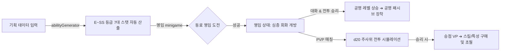

# AI TRPG Simulator (R&D Sandbox)

> **온디바이스 AI(WebLLM) 가상화 기술 및 브라우저 내 오프라인 스토리지(IndexedDB) R&D 샌드박스**
> 
> *본 프로젝트는 외부 AI API 호출 비용을 차단하기 위한 '온디바이스 AI(On-Device AI)'의 웹 환경 가동 가능성을 검증하고, 브라우저 로컬 저장 공간의 5MB 용량 한계를 극복하도록 설계된 대용량 오프라인 캐싱 아키텍처 기반의 하이브리드 TRPG 샌드박스 프로토타입입니다.*

---

## 목차
1. [R&D 연구 과제 및 기술적 검증 결과](#1-rd-연구-과제-및-기술적-검증-결과)
   * [A. WebLLM 온디바이스 가상화 및 모바일 병목 분석](#a-webllm-온디바이스-가상화-및-모바일-병목-분석)
   * [B. IndexedDB 기반 이미지 분산 캐싱 레이어](#b-indexeddb-기반-이미지-분산-캐싱-레이어)
2. [핵심 콘텐츠 및 플레이 메커니즘](#2-핵심-콘텐츠-및-플레이-메커니즘)
   * [A. d20 주사위 기반 전투 공식](#a-d20-주사위-기반-전투-공식)
   * [B. 영입 및 공명(호감도) 시스템](#b-영입-및-공명호감도-시스템)
   * [C. 초월(Ascension) 카드 덱빌딩 시스템](#c-초월ascension-카드-덱빌딩-시스템)
3. [시스템 아키텍처 및 무결성 제어](#3-시스템-아키텍처-및-무결성-제어)
4. [시작 가이드 (설치 및 로컬 실행)](#4-시작-가이드-설치-및-로컬-실행)

---

## 1. R&D 연구 과제 및 기술적 검증 결과

본 프로젝트는 최신 웹 프론트엔드 기술 및 브라우저 탑재형 AI 엔진의 연산 한계를 검증하기 위한 개념 검증(Proof of Concept) R&D 목적으로 구축되었습니다.

### A. WebLLM 온디바이스 가상화 및 모바일 기기 병목 분석
*   **연구 개요**: 브라우저 표준 WebGPU 및 CPU 자원을 활용하여 웹 클라이언트 환경에서 소형 오픈소스 언어 모델(Llama-3, Gemma-2B 등)을 오프라인 구동하는 `WebLLMDemo` 환경을 탑재했습니다.
*   **기술적 제약 사항 (Technical Bottlenecks)**:
    1.  **메모리(RAM) 크래시**: iOS Safari 및 사양이 낮은 모바일 기기에서는 메모리(Shared RAM) 제약으로 인해 소형 LLM 가중치를 메모리에 로드하는 도중 브라우저 탭이 강제 종료되는 현상을 확인했습니다.
    2.  **연산 속도 병목**: 모바일 WebGPU 규격 미흡으로 인해 데스크톱 환경 대비 토큰 출력 속도(Tokens Per Second)가 현저히 감소하는 현상을 기록했습니다.
*   **대안 아키텍처 설계**: 하드웨어 리소스 제약에 대응하기 위해, 클라이언트 사이드 비동기 연산으로 스탯과 특성을 임의 생성할 수 있는 가상 로컬 AI 엔진(`abilityGenerator.ts`)을 스위칭 구동할 수 있도록 코드를 이중화 설계하여 무중단 서비스 안정성을 확보했습니다.

### B. IndexedDB 기반 이미지 분산 캐싱 레이어
*   **연구 개요**: 브라우저 기본 `LocalStorage`는 텍스트 기준 약 5MB의 용량 제한을 가지므로, AI가 생성한 대용량 캐릭터 초상화(Base64) 및 이미지 데이터를 다수 보존하기 어렵습니다.
*   **해결 방법**: 비동기 트랜잭션을 지원하는 브라우저 데이터베이스인 `IndexedDB`를 래핑한 `imageStore.ts` 모듈을 구축했습니다.
*   **성과**: 용량 제한을 해제하여, 서버 리소스를 사용하지 않고 생성된 Base64 미디어 데이터를 오프라인 상에 적재, 조회, 삭제할 수 있는 구조를 구축했습니다.

---

## 2. 핵심 콘텐츠 및 플레이 메커니즘



### A. d20 주사위 기반 전투 공식
TRPG의 주사위 시스템인 **d20(20면체 주사위) 시스템**을 프론트엔드 연산으로 구현했습니다.
*   **명중/회피 공식**:
    $$\text{공격자 명중 판정} = \text{정확도 스탯 값} + \text{d20 주사위 눈}$$
    $$\text{방어자 회피 판정} = \text{민첩성 스탯 값} + \text{d20 주사위 눈}$$
    *   *결과*: 공격자의 수치가 더 클 경우 명중(Hit)하며, 방어자가 더 크거나 같을 경우 회피(Dodge) 처리됩니다.
*   **피해량 공식**:
    $$\text{최종 물리 데미지} = (\text{공격력 스텟 값} + \text{d8 주사위 눈}) - \text{방어자 방어력 스텟 값}$$
    *   최종 데미지가 0 이하인 경우라도 최소 데미지 1은 보증합니다.
*   **상태이상**: `독(POISON)`, `기절(STUN)`, `화상(BURN)`, `둔화(SLOW)`, `취약(VULNERABLE)`, `실명(BLIND)` 등의 턴 감쇄 로직을 연동했습니다.

### B. 영입 및 공명(호감도) 시스템
*   **영입 회화**: 캐릭터와의 대화를 통해 획득한 힌트를 활용해 영입 미니게임을 진행하며 동료(`RECRUITED`)로 영입합니다.
*   **공명(Resonance) 결속**: 동료 영입 이후 전투 승리 시 공명 경험치(Resonance EXP)가 누적되며, 레벨업에 따라 패시브 효과가 해제되어 캐릭터에 장착됩니다.

### C. 초월(Ascension) 카드 덱빌딩 시스템
*   전투 승리를 통해 획득한 승점(VP)을 소모하여 새로운 특성, 패시브, 액티브 스킬을 잠금 해제합니다.
*   캐릭터 슬롯에 장착할 카드 구성을 변경하여 전술적 덱빌딩 메커니즘을 제공합니다.

---

## 3. 시스템 아키텍처 및 무결성 제어

*   **클라이언트 오프라인 독립 구동 (Client-Side Independence)**:
    외부 API 연결 상태나 API 키가 누락되더라도 프론트엔드에서 로컬 데이터 생성 엔진으로 자동 전환되어 가동을 지속하도록 설계했습니다.
*   **다국어(i18n) 지원**:
    데이터 및 룰북 텍스트가 영어(`en`)와 한국어(`ko`) 환경에 맞춰 동적으로 라우팅 및 렌더링되도록 구성되었습니다.

---

## 4. 시작 가이드 (설치 및 로컬 실행)

### 1. 로컬 실행 환경 준비
본 프로젝트는 Vite 기반의 HMR 환경으로 구성되어 있습니다. 로컬 구동을 위해 Node.js 설치가 필요합니다.

### 2. 실행 명령어
```bash
# 1. 의존성 패키지 설치
npm install

# 2. 로컬 개발 서버 기동 (Vite HMR)
npm run dev

# 3. 배포용 정적 릴리즈 번들 생성
npm run build
```
