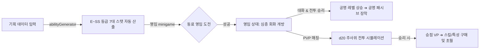

# 🎲 AI TRPG Simulator (R&D Sandbox)

> **서버리스 온디바이스 AI(WebLLM) 가상화 기술 및 고성능 오프라인 스토리지(IndexedDB) 실험을 위한 R&D 샌드박스**
> 
> *본 프로젝트는 외부 AI 서버 자원 호출 비용을 극단적으로 차단하는 '온디바이스 AI(On-Device AI)'의 실현 가능성을 검증하고, 브라우저 스토리지의 5MB 용량 한계를 극복하기 위해 설계된 대용량 오프라인 캐싱 아키텍처 기반의 하이브리드 TRPG 샌드박스 프로토타입입니다.*

---

## 📖 목차
1. [R&D 연구 과제 및 기술적 검증 결과](#1-rd-연구-과제-및-기술적-검증-결과)
   * [A. WebLLM 온디바이스 가상화 & 모바일 Bottleneck 분석](#a-webllm-온디바이스-가상화--모바일-bottleneck-분석)
   * [B. IndexedDB 기반 이미지 분산 캐싱 Layer](#b-indexeddb-기반-이미지-분산-캐싱-layer)
2. [핵심 콘텐츠 및 플레이 메커니즘](#2-핵심-콘텐츠-및-플레이-메커니즘)
   * [A. d20 주사위 기반 정밀 전투 공식](#a-d20-주사위-기반-정밀-전투-공식)
   * [B. 영입 및 공명(호감도) 시스템](#b-영입-및-공명호감도-시스템)
   * [C. 초월(Ascension) 카드 덱빌딩 시스템](#c-초월ascension-카드-덱빌딩-시스템)
3. [시스템 아키텍처 및 무결성 제어](#3-시스템-아키텍처-및-무결성-제어)
4. [시작 가이드 (설치 및 로컬 실행)](#4-시작-가이드-설치-및-로컬-실행)

---

## 1. R&D 연구 과제 및 기술적 검증 결과

본 프로젝트는 단순 B2C 제품 개발이 아닌, 최신 프론트엔드 최적화 기술 및 브라우저 탑재형 AI 엔진의 한계를 시험하기 위한 **개념 검증(Proof of Concept)** R&D 샌드박스로 빌드되었습니다.

### A. WebLLM 온디바이스 가상화 & 모바일 Bottleneck 분석
*   **연구 개요**: 브라우저 표준 WebGPU 및 CPU 자원을 연동해 웹 프론트엔드 단독 환경에서 AI 모델(Llama-3, Gemma-2B 등)을 로컬로 구동하는 `WebLLMDemo` 환경 탑재.
*   **성능 검증 및 한계점 기록 (Technical Bottlenecks)**:
    1.  **메모리(RAM) 크래시 한계**: 모바일 브라우저(특히 iOS Safari 및 저가형 안드로이드 기기)는 공유 시스템 메모리(Shared RAM) 제약이 심해 1.5GB 이상의 소형 LLM 가중치를 메모리에 로드하는 도중 브라우저 탭이 즉시 크래시(Crash/Out of Memory)되는 치명적 한계를 확인했습니다.
    2.  **연산 속도(T/S) 병목**: 모바일 칩셋의 모바일 WebGPU 규격 미흡으로 인해 데스크톱 환경 대비 5배~10배 이상 느린 토큰 출력 속도(Tokens Per Second)를 확인했습니다.
*   **아키텍처 대안 설계**: 해당 물리적 하드웨어 한계를 극복하기 위해, 프로덕션 환경에서는 완전 비동기 클라이언트 사이드 **[로컬 가상 AI 엔진(abilityGenerator.ts)]**을 하이브리드 스위칭할 수 있도록 코드를 이중화 설계했습니다. 이를 통해 **서버 비용 0원과 무중단 서비스 신뢰성**을 철저히 확보했습니다.

### B. IndexedDB 기반 이미지 분산 캐싱 Layer
*   **연구 개요**: 브라우저 기본 `LocalStorage`는 텍스트 데이터 기준 약 **5MB**의 치명적인 용량 한계를 지닙니다. AI가 실시간 드로잉한 대용량 캐릭터 초상화(Base64)와 전투 기념 배너 일러스트를 다수 영구 보존하는 것은 원천적으로 불가능했습니다.
*   **해결 기법**: 비동기 트랜잭션 브라우저 데이터베이스인 `IndexedDB`를 안전하게 래핑한 [imageStore.ts](file:///c:/Users/Dolveul/Desktop/Project/1.Backup/github_backup/trpg/services/imageStore.ts) 모듈을 독립 설계했습니다.
*   **성과**: 용량 한계가 완전히 해제되어, 유저가 백그라운드 서버 비용 없이 **초고용량 Base64 AI 미디어 세션 데이터 수백 장을 안전하게 오프라인에 구조적으로 적재/조회/삭제**할 수 있는 메모리 해방 아키텍처를 구현했습니다.

---

## 2. 핵심 콘텐츠 및 플레이 메커니즘



### A. d20 주사위 기반 정밀 전투 공식
TRPG의 정통적인 기하 난수 시스템인 **d20(20면체 주사위) 시스템**을 프론트엔드 연산으로 완전 논리 구현했습니다.
*   **명중/회피 공식**:
    $$\text{공격자 명중 판정} = \text{정확도 스텟 값} + \text{d20 주사위 눈}$$
    $$\text{방어자 회피 판정} = \text{민첩성 스텟 값} + \text{d20 주사위 눈}$$
    *   *결과*: 공격자의 수치가 더 클 경우 명중(Hit)하며, 방어자가 더 크거나 같을 경우 회피(Dodge) 처리됩니다.
*   **피해량 공식**:
    $$\text{최종 물리 데미지} = (\text{공격력 스텟 값} + \text{d8 주사위 눈}) - \text{방어자 방어력 스텟 값}$$
    *   최종 데미지가 0 이하인 경우라도 **최소 데미지 1**을 확실히 보장합니다.
*   **디버프 상태이상**: `독(POISON)`, `기절(STUN)`, `화상(BURN)`, `둔화(SLOW)`, `취약(VULNERABLE)`, `실명(BLIND)` 등의 지속 턴 감쇄 로직 연동.

### B. 영입 및 공명(호감도) 시스템
*   **영입 회화**: 야생의 캐릭터와 1:1 대화를 나누고, 캐릭터의 스텟과 대사 힌트를 공략하는 영입 미니게임을 거쳐 파티 동료(`RECRUITED`)로 포섭합니다.
*   **공명(Resonance) 결속**: 동료 영입 이후 대화 및 전투 승리 시 공명 경험치(Resonance EXP)가 축적되며, 레벨업 시 **전투 시작 시 고유 마나 증가/쉴드량 부여** 등 막강한 전력 시너지를 발생시키는 공명 전용 패시브가 장착됩니다.

### C. 초월(Ascension) 카드 덱빌딩 시스템
*   전투 승리를 통해 획득한 **승점(VP)**으로 풀에 있는 새로운 특성(Traits), 패시브, 강력한 액티브 특수 스킬을 언락합니다.
*   장착 슬롯의 빌드를 자유롭게 커스텀 변경하여 나만의 전술 몬스터/동료를 커스텀 성격에 맞춰 육성하는 깊은 덱빌딩 기믹을 제공합니다.

---

## 3. 시스템 아키텍처 및 무결성 제어

*   **100% 클라이언트 오프라인 가동 (Client-Side Independence)**:
    외부 API 연결이 완전히 끊기거나 개발 환경에서 GEMINI API Key가 유실되어도 프론트엔드가 크래시나지 않고 즉시 로컬 데이터 생성 엔진으로 포지셔닝하여 무중단 플레이를 보증하는 **자기 완비형(Self-Contained) 시스템**입니다.
*   **i18n 글로벌 아키텍처**:
    모든 기획 데이터, 대화 로그, 룰북 텍스트가 영어(`en`)와 한국어(`ko`) 컨텍스트를 완벽하게 추종하여 라우팅 전환이 이뤄지도록 설계되었습니다.

---

## 4. 시작 가이드 (설치 및 로컬 실행)

### ⚙️ 1. 로컬 실행 환경 준비
본 프로젝트는 Vite 기반의 초고속 HMR 환경으로 구성되어 있습니다. Node.js가 설치되어 있어야 합니다.

### 🚀 2. 실행 명령어
```bash
# 1. 의존성 패키지 설치
npm install

# 2. 로컬 개발 서버 기동 (Vite HMR)
npm run dev

# 3. 배포용 정적 릴리즈 번들 생성
npm run build
```
